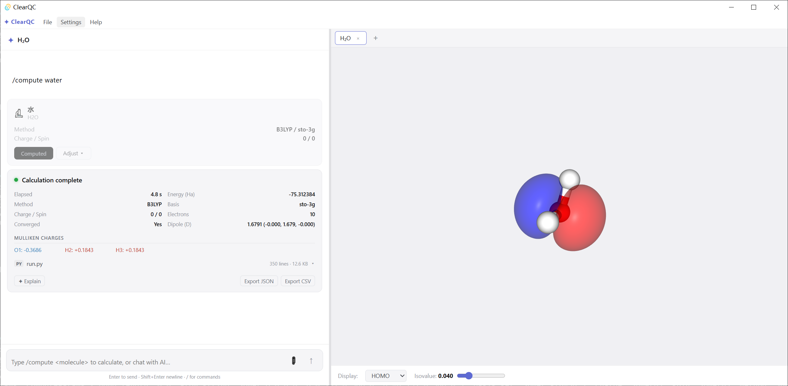

<div align="center">

# ✦ ClearQC

**Quantenchemie auf deinem eigenen Computer**

[📥 Download](https://github.com/SigmaAdrich/ClearQC/releases/latest) · [🐛 Fehler melden](https://github.com/SigmaAdrich/ClearQC/issues)

**[English](README.md) · [中文](README.zh.md) · Deutsch · [日本語](README.ja.md)**

</div>

---

## Was ist das hier?

Hast du dich jemals gefragt — **wie sieht ein Molekül wirklich aus? Wie sind seine Elektronen verteilt? Warum bricht diese Bindung, aber nicht jene?**

Diese Fragen lassen sich theoretisch mit der Quantenmechanik berechnen — genau das macht die „Quantenchemie" oder „Computerchemie".

Traditionell erfordert eine solche Berechnung jedoch:

- Einen Linux-Server einrichten
- Eingabedateien über die Kommandozeile schreiben lernen
- Lange Warteschlangen in Job-Schedulern
- Ausgabedateien manuell kopieren und Graphen von Hand erstellen

Diese Arbeitsweise hat eine sehr steile Lernkurve — viele Studierende geben auf, bevor sie überhaupt angefangen haben.

**ClearQC hat das Ziel, all diese Hürden zu beseitigen.**

Sag der Software einfach, welches Molekül du berechnen möchtest — tippe zum Beispiel „Coffein" oder „Benzol" — klicke auf einen Button, und nach wenigen Minuten siehst du:

- Die dreidimensionale Struktur des Moleküls
- Gesamtenergie und Atomladungsverteilung
- Visualisierung der Grenzorbitale (HOMO / LUMO)
- IR- oder UV-Vis-Absorptionsspektrum (wenn du die entsprechende Aufgabe gewählt hast)

**Alles läuft lokal auf deinem Windows-PC. Keine Internetverbindung für die Berechnungen notwendig, kein Konto erforderlich, keine Python-Kenntnisse nötig.**

---

## Was kann Quantenchemie überhaupt berechnen?

Falls dir „Quantenchemie" abstrakt klingt, hier sind konkrete Beispiele:

**🔬 Geometrieoptimierung**
Ausgehend von einer groben Startstruktur sucht der Computer die stabilste 3D-Form des Moleküls — die Konfiguration mit der niedrigsten Energie. Stell es dir vor wie eine gespannte Feder, die in ihre natürliche Gleichgewichtslage zurückschnappt.

**⚡ Grenzorbitale (HOMO / LUMO)**
HOMO steht für „Highest Occupied Molecular Orbital" (höchstes besetztes Molekülorbital), LUMO für „Lowest Unoccupied Molecular Orbital" (niedrigstes unbesetztes Molekülorbital). Diese beiden Orbitale bestimmen, wo ein Molekül bei einer Reaktion Elektronen abgibt oder aufnimmt — also seine chemische Reaktivität. ClearQC stellt sie als anschauliche 3D-Isoflächen dar.

**🌈 UV-Vis-Absorptionsspektrum (TD-DFT)**
Warum absorbiert Benzol im UV-Bereich? Warum haben Farbstoffe eine Farbe? Angeregte-Zustands-Rechnungen (TD-DFT) sagen vorher, welche Lichtwellenlängen ein Molekül absorbiert — direkt vergleichbar mit experimentellen UV-Vis-Spektrometerdaten.

**📳 Infrarotspektrum (IR)**
Chemische Bindungen schwingen wie Federn bei bestimmten Frequenzen. Eine Frequenzanalyse sagt vorher, wo IR-Absorptionsbanden erscheinen — direkt vergleichbar mit dem, was ein IR-Spektrometer im Labor misst.

**🧪 Mulliken-Ladungen**
Zeigt, wie viel überschüssige Ladung jedes Atom trägt — hilfreich zum Verständnis von Polarität, Wasserstoffbrückenbindungen und nukleophilen/elektrophilen Reaktionszentren.

---

## Screenshots



---

## Funktionen

| Funktion | Beschreibung |
|----------|-------------|
| Molekülbibliothek | Name eingeben (Deutsch, Englisch oder IUPAC) → Autovervollständigung → Berechnung starten |
| Datei-Import | XYZ-, PDB-, MOL/SDF- oder Gaussian-GJF-Dateien per Drag & Drop |
| Methoden | HF · 21 DFT-Funktionale (B3LYP, PBE0, M06-2X, ωB97X-V, CAM-B3LYP …) · Post-HF (MP2, CCSD, CCSD(T)) |
| Basissätze | 28 Basissätze aus den Familien Pople, Dunning, Karlsruhe, pcseg und ECP |
| Einzelpunktenergie | Elektronische Energie für eine gegebene Geometrie berechnen |
| Geometrieoptimierung | Stabilste Molekülstruktur automatisch finden |
| Frequenzanalyse | Schwingungsfrequenzen berechnen und IR-Spektrum erzeugen |
| Angeregte Zustände (TD-DFT) | Lichtabsorption berechnen und UV-Vis-Spektrum erzeugen |
| Lösungsmitteleffekte | 8 implizite Lösungsmittel (ddCOSMO): Wasser, DMSO, Methanol, Ethanol, Acetonitril, THF, DCM, Toluol |
| 3D-Visualisierung | Kugel-Stab-Modell + HOMO/LUMO/Elektronendichte-Isoflächen |
| KI-Assistent | Remote-API (OpenAI-kompatibel), automatische Ergebnis-Erklärung und Fehlerdiagnose |
| Export | Ergebnisse als JSON / CSV / IR / UV-Vis-Daten |
| Sprachen | English / 中文 / Deutsch / 日本語 |
| Theme & Schriftgröße | Hell-/Dunkel-Modus, 4 Schriftgrößen-Stufen |

---

## Systemanforderungen

ClearQC unterstützt derzeit nur **Windows 10 / 11 (64-Bit)**.

Außerdem muss **WSL 2** (Windows-Subsystem für Linux 2) aktiviert sein. WSL 2 ist eine eingebaute Windows-Funktion, die es Windows ermöglicht, Linux-Programme auszuführen — ClearQCs Berechnungsmodul (PySCF) läuft in dieser Linux-Umgebung. **Du musst Linux überhaupt nicht kennen**; ClearQC erledigt alles automatisch.

### WSL 2 aktivieren

1. Öffne PowerShell **als Administrator** (im Startmenü nach „PowerShell" suchen → Rechtsklick → Als Administrator ausführen)
2. Führe folgenden Befehl aus:
   ```
   wsl --install
   ```
3. Warte, bis die Installation abgeschlossen ist, und **starte deinen Computer neu**

Nach dem Neustart ist WSL 2 bereit. Bei Problemen hilft die [offizielle Microsoft-Dokumentation](https://learn.microsoft.com/de-de/windows/wsl/install).

### Hardware-Empfehlungen

| | Minimum | Empfohlen |
|--|---------|-----------|
| RAM | 4 GB | 8 GB oder mehr |
| Speicherplatz | 600 MB | 1 GB+ (für temporäre Berechnungsdateien) |
| CPU | Beliebig x64 | Mehr Kerne = schnellere Berechnungen |

---

## Download & Installation

Lade die neueste Version von der [Releases-Seite](https://github.com/SigmaAdrich/ClearQC/releases/latest) herunter.

Der `.exe`-Installer ist ca. 135 MB groß. Das Berechnungsmodul ist bereits enthalten — **keine Internetverbindung** ist für Installation oder Nutzung erforderlich.

### Installationsschritte

1. Lade die `.exe`-Datei herunter
2. Doppelklick zum Starten. Windows zeigt möglicherweise eine Sicherheitswarnung an („Windows hat deinen Computer geschützt"). Klicke auf **Weitere Informationen → Trotzdem ausführen**
3. Folge dem Installationsassistenten
4. Starte **ClearQC** über das Startmenü oder die Desktop-Verknüpfung
5. **Beim ersten Start** importiert die App automatisch die WSL-Berechnungsumgebung — das dauert etwa 30–60 Sekunden. Bitte warte
6. Sobald die Hauptoberfläche erscheint, kann es losgehen!

---

## Schnellstart in 5 Minuten

**Schritt 1: Molekülnamen eingeben**

Tippe im Chat-Eingabefeld unten links `/compute caffeine` und drücke Enter.

Die App sucht Coffein in der eingebauten Molekülbibliothek und zeigt eine **Berechnungskarte** im Chat-Panel.

**Schritt 2: Parameter einstellen**

Die Karte verwendet bereits empfohlene Standardwerte (B3LYP / def2-SVP — gute Balance aus Geschwindigkeit und Genauigkeit). Klicke auf **Adjust** für weitere Optionen:

- **Methode**: HF, 21 DFT-Funktionale (B3LYP, PBE0, M06-2X, ωB97X-V, CAM-B3LYP …) oder Post-HF (MP2 / CCSD / CCSD(T))
- **Basis**: 28 Basissätze nach Familien gruppiert (Pople, Dunning, Karlsruhe, pcseg, ECP); Standard ist def2-SVP
- **Aufgabe**: Einzelpunkt (SP) / Optimierung (Opt) / Frequenz (Freq) / Angeregte Zustände
- **Lösungsmittel**: Eines von 8 Lösungsmitteln auswählen, um Berechnungen in Lösung zu simulieren

Beim ersten Versuch einfach alles bei den Standardwerten lassen.

**Schritt 3: Compute klicken**

Klicke auf den grünen **Compute**-Button. Die Statusleiste rechts zeigt den Berechnungsfortschritt.

Ein kleines Molekül wie Coffein benötigt mit den Standardwerten (B3LYP / def2-SVP) etwa 1–3 Minuten.

**Schritt 4: Ergebnisse ansehen**

Nach Abschluss der Berechnung erscheint eine Ergebniskarte mit:

- Gesamtenergie (in Hartree)
- Konvergenzstatus
- Mulliken-Atomladungen
- Berechnungszeit

Das rechte Panel zeigt gleichzeitig die 3D-Struktur. Mit dem Dropdown-Menü kannst du zwischen **HOMO, LUMO und Elektronendichte**-Isoflächen wechseln.

**Schritt 5 (optional): KI-Erklärung der Ergebnisse**

ClearQC bringt kein eigenes KI-Modell mit — du verbindest eine OpenAI-kompatible API selbst. Sobald sie konfiguriert ist, werden die Buttons **AI Explain** (Ergebnis erklären) und **AI Diagnose** (Fehlerdiagnose) auf der Ergebniskarte aktiv.

**Konfigurations-Schritte:**

1. Top-Menü **Settings → AI Configuration…** öffnet den Konfigurationsdialog
2. Drei Felder ausfüllen:

   | Feld | Inhalt | Beispiel |
   |---|---|---|
   | **API Base URL** | Der API-Endpunkt (ohne abschließendes `/chat/completions`) | OpenAI: `https://api.openai.com/v1`<br>DeepSeek: `https://api.deepseek.com/v1`<br>Moonshot: `https://api.moonshot.cn/v1` |
   | **API Key** | Dein Schlüssel, beginnt meist mit `sk-`. Auf der „API Keys"-Seite des Anbieters kopieren | `sk-xxxxxxxxxxxxx` |
   | **Model** | Modellname. Wähle etwas Günstiges und Schnelles | `gpt-4o-mini` / `deepseek-chat` / `moonshot-v1-8k` |

3. **Save** klicken

Zurück zur Ergebniskarte und auf **AI Explain** klicken — die KI beschreibt in Klartext, was berechnet wurde, was die Energie bedeutet, ob die Ladungsverteilung plausibel ist und worauf du achten solltest. Schlägt eine Berechnung fehl, erscheint stattdessen **AI Diagnose** und analysiert den Fehler (meist falsche Ladungs-/Spin-Einstellung oder unpassende Methode).

> **Keine kostenpflichtige API?** Die meisten LLM-Anbieter geben bei der Registrierung kostenloses Guthaben (OpenAI-Probekontingent, DeepSeek-Willkommensbonus, Moonshot-Monatslimit). Einfach registrieren, auf der „API Keys"-Seite einen Schlüssel erstellen und einfügen.

---

## Häufige Fragen

**F: Die App öffnet sich nicht oder meldet, WSL wurde nicht gefunden?**
A: Stelle sicher, dass WSL 2 gemäß der obigen Anleitung aktiviert ist, und starte den PC neu.

**F: Der erste Start bleibt bei „Berechnungsumgebung wird importiert" hängen?**
A: Das ist normal — der WSL-Import dauert je nach Festplattengeschwindigkeit 30–60+ Sekunden. Bitte warten; Fenster nicht schließen.

**F: Berechnung schlägt fehl?**
A: Häufigste Ursache ist eine falsche Ladungs- oder Spin-Einstellung (z.B. ein Kation berechnen ohne die Ladung auf +1 zu setzen). Klicke auf **AI Diagnose** auf der Ergebniskarte für eine automatische Diagnose.

**F: Welche Dateiformate werden unterstützt?**
A: XYZ, PDB, MOL/SDF und Gaussian GJF/COM können direkt ins Fenster gezogen werden.

**F: Berechnungen sind sehr langsam?**
A: Quantenchemische Berechnungen sind rechenintensiv. Größere Moleküle, größere Basissätze und genauere Methoden dauern länger. Beginne mit den Standardeinstellungen (B3LYP / def2-SVP) und einer Einzelpunktrechnung (SP); wechsle bei Bedarf zu genaueren Methoden (MP2, CCSD(T)) oder größeren Basissätzen (cc-pVTZ, def2-TZVP).

**F: Wird Mac oder Linux unterstützt?**
A: Derzeit nicht. Nur Windows 10/11. Mac/Linux-Support ist nicht geplant.

---

## Feedback & Support

Fehler gefunden, Wünsche für neue Funktionen oder einfach Lust auf Austausch über quantenchemische Workflows? Erreich uns über einen der folgenden Kanäle:

- **GitHub Issues**: [Fehler melden oder Features vorschlagen](https://github.com/SigmaAdrich/ClearQC/issues)
- **E-Mail**: 540059610@qq.com
- **Discord-Server**: <https://discord.gg/gNkRV2xkC3>

---

## Lizenz

© 2025 SigmaAdrich. All rights reserved.